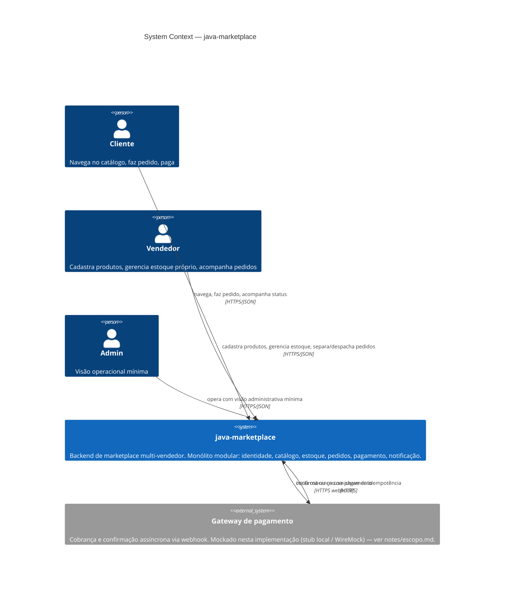
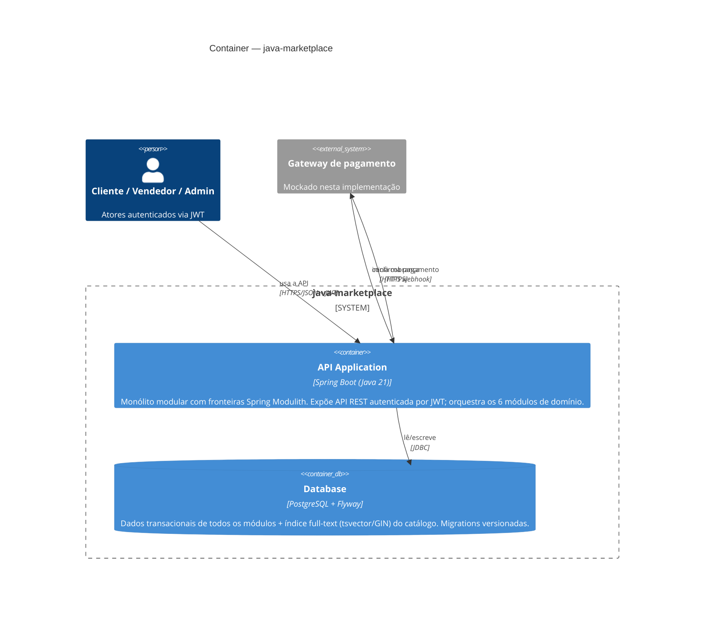
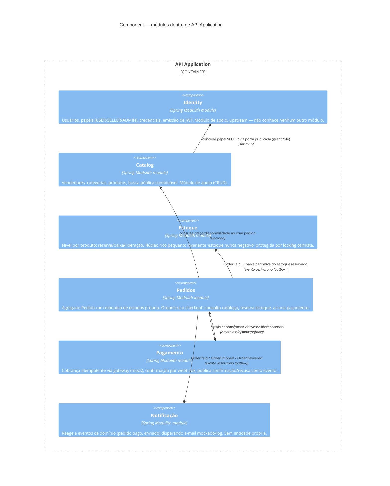

# Arquitetura — visão geral (C4)

Este documento usa o [C4 Model](https://c4model.com/) para descrever a arquitetura do
`java-marketplace` em três níveis de zoom: **Context**, **Container** e **Component**. Não há
nível **Code** — como o [guia de referência desta skill](https://c4model.com/) recomenda, esse
nível compensa pouco desenhado à mão e a IDE já gera diagrama de classes sob demanda quando
necessário.

Os diagramas são feitos em [Mermaid](https://mermaid.js.org/) (`C4Context`/`C4Container`/
`C4Component`), que renderiza direto no GitHub. O suporte do Mermaid a C4 é experimental — a
notação de cor é livre; a legenda abaixo de cada diagrama é o que fixa o significado.

Para o *porquê* das fronteiras de módulo e das regras de comunicação usadas aqui, ver
[ADR-0001](../adr/0001-monolito-modular.md) e [notes/fluxo-cross-module-ownership.md](../notes/fluxo-cross-module-ownership.md).

---

## Nível 1 — System Context

Visão de fora: quem usa o sistema e com que outros sistemas ele conversa. `java-marketplace` é
uma caixa só.

**Legenda:** setas cheias = chamada HTTP síncrona (pedido/resposta). `java-marketplace` é o único
sistema desenvolvido neste repositório; o gateway de pagamento é o único sistema externo — está
mockado hoje (ver [notes/escopo.md](../notes/escopo.md)), mas é modelado como externo porque, na
intenção arquitetural, é sempre um sistema de terceiros.

---

## Nível 2 — Container

Zoom para dentro de `java-marketplace`. Como o sistema é um **monólito modular** por decisão
explícita ([ADR-0001](../adr/0001-monolito-modular.md)), este nível é propositalmente enxuto: há
um único container executável. A riqueza dos seis bounded contexts só aparece no nível
**Component**, a seguir — a magreza deste diagrama é, ela mesma, a prova visual da decisão do
ADR-0001 (nenhum módulo virou processo/deploy próprio).

**Legenda:** um único deploy (`API Application`) fala com um único banco relacional. Não há
fila/broker: eventos de domínio entre módulos são in-process (Spring Modulith Event Publication
Registry — ver [design/nucleo-pedido-pagamento-estoque.md](../design/nucleo-pedido-pagamento-estoque.md)),
não um container à parte. Caminho de extração futura (um módulo virar processo próprio, broker
real) preservado, mas não construído — gatilho de revisão descrito no ADR-0001.

---

## Nível 3 — Component (zoom em `API Application`)

Este é o diagrama com mais sinal do conjunto: zoom para dentro do único container, mostrando os
seis bounded contexts e — o ponto central — **como cada um se comunica com os outros**: chamada
síncrona (quando a resposta decide o que fazer agora) ou evento de domínio assíncrono (quando
não). A regra e os exemplos vêm de [ADR-0001](../adr/0001-monolito-modular.md) e
[notes/fluxo-cross-module-ownership.md](../notes/fluxo-cross-module-ownership.md).

**Legenda:**

- **Síncrono** (linha "síncrono" no rótulo) — usado só quando o módulo chamador precisa da
  resposta *agora* para decidir o que fazer. Cria dependência de compilação na direção da seta.
- **Evento assíncrono** (linha "evento assíncrono (outbox)") — o publicador não conhece os
  assinantes; não cria dependência de compilação nenhuma. É o que mantém o grafo entre módulos
  **acíclico** — verificado em teste pelo Spring Modulith. Note que `Pedidos ↔ Pagamento` usa os
  dois modos em direções diferentes (comando síncrono para *iniciar*, evento para *confirmar*)
  justamente para não formar um ciclo de dependência síncrona entre os dois.
- Seta de dependência sagrada: `catalog → identity`, nunca o inverso (identity não sabe o que é
  `Seller`) — ver [notes/fluxo-cross-module-ownership.md](../notes/fluxo-cross-module-ownership.md).
- Detalhe completo de cada evento e da idempotência de pagamento:
  [design/nucleo-pedido-pagamento-estoque.md](../design/nucleo-pedido-pagamento-estoque.md).

Não há diagrama de Component para os módulos de apoio (`identity`, `catalog`, `notificação`) —
são CRUD/anêmicos de propósito e não têm complexidade interna que justifique mais um zoom.
